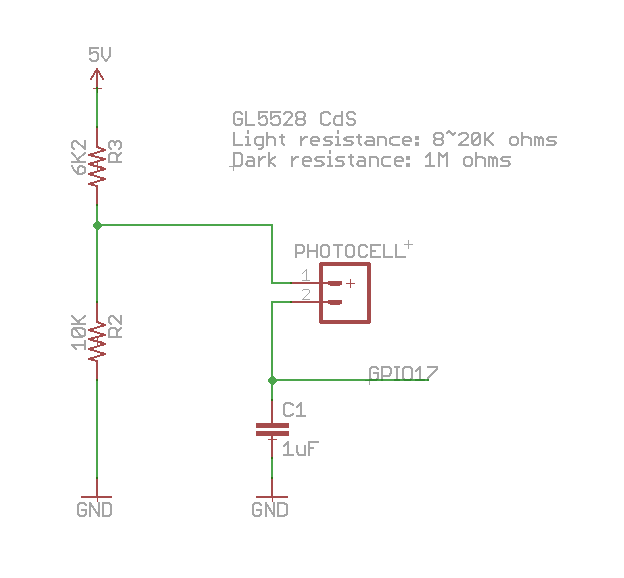
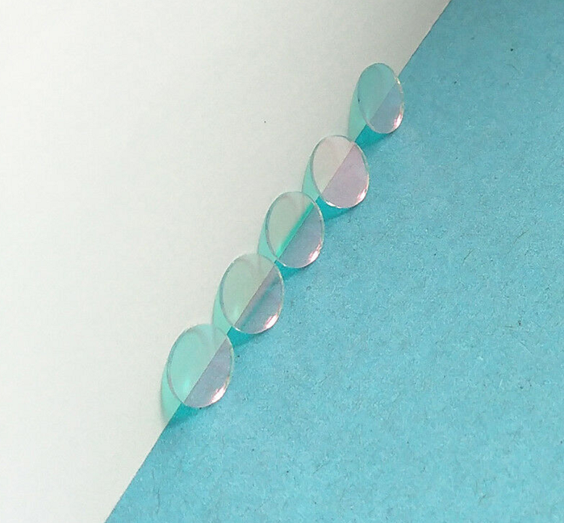

# ldr-reader

Light Dependent Resistor (CdS) reader

Above circuit diagram is a low cost way of detecting ambient light using a GPIO pin. It works by setting the GPIO pin to output to drain the capacitor, then set the GPIO to input to let the capacitor charge and detect the time it takes read a high on the GPIO. The amount of time needed to charge the capacitor is determined by the resistance of the CdS sensor, which corresponds to brightness.

This program reads the CdS sensor and debounces the sensor measurement. It has configurable hysteresis thresholds to prevent excessive state transitions. When a state transition occurs, it can be configured to perform multiple actions like set output GPIO pins and run a command.

The CdS sensor may be affected by IR light from IR LEDs and it is recommended to add an IR-cut filter in front of the CdS sensor and put a black heatshrink around it. An IR-cut filter like this [7mm UV/IR650 cut optical glass filter](https://www.ebay.com.au/itm/253225596892) should do the job.

